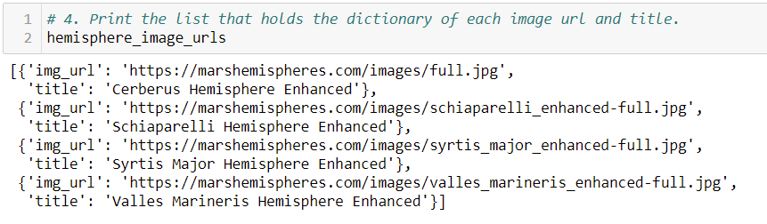
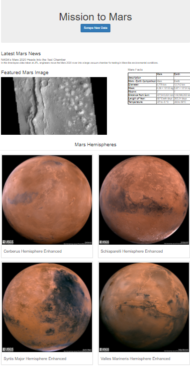
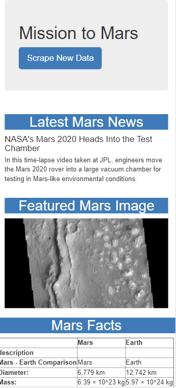
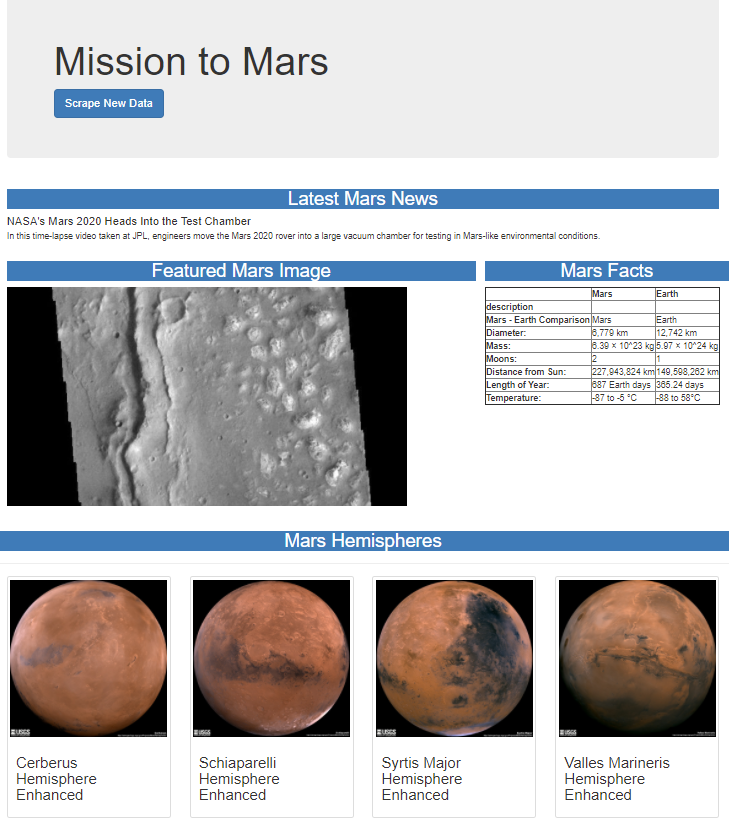

# Mission-to-Mars

## Overview

This project is the tenth weekly challenge of the Data Science Bootcamp. It allows us to put into practice and showcase the skills learned in Module 10 of the bootcamp.

### Purpose

Improve the functionality of the Mission-to-mars web app to include the 4 hemisphere images.

## Results

The following files are available:

- [app.py](./app.py) and its dependency [scraping.py](./scraping.py)
- [Mission_to_Mars_Challenge.ipynb](./Mission_to_Mars_Challenge.ipynb)
- [/templates/index.html](./templates/index.html)

### Deliverable 1: Scrape Full-Resolution Mars Hemisphere Images and Titles

In the Jupyter Notebook [Mission_to_Mars_Challenge.ipynb](./Mission_to_Mars_Challenge.ipynb), I used BeautifulSoup and Splinter to scrape full-resolution images of Mar's hemispheres and the titles of those images.

I used Splinter to click on the link on each thumb image and then BeautifulSoup to find the url and the title of the image on the additional pages visited and populate these values into a list of dictionaries.  Below is the main piece of code for this deliverable.

```python
# 2. Create a list to hold the images and titles.
hemisphere_image_urls = []
# 3. Write code to retrieve the image urls and titles for each hemisphere.
thumb_images = browser.find_by_tag("h3")

# Visit each site and scrape .jpg image
for i in range(4):
    thumb_images[i].click()
    # Optional delay for loading the page
    browser.is_element_present_by_css('div.list_text', wait_time=1)

    # Parse the resulting html with soup
    html = browser.html
    img_soup = soup(html, 'html.parser')

    #Find and add the image URL and the title and add to the dictionary
    download_box = img_soup.find("div", class_="downloads")
    img_url_rel = download_box.find("a", target="_blank")['href']
    img_url = f"{url}{img_url_rel}"
    title = img_soup.find("h2", class_="title").text
    hemisphere_image_urls.append({'img_url':img_url, 'title':title})
    
    # return to previous page
    browser.back()
    # Delay for loading the page
    browser.is_element_present_by_css('div.list_text', wait_time=1)
    #need to reevaluate thumb_images before the next visit
    thumb_images = browser.find_by_tag("h3")
```

The final list of dictionary can be seen here:



### Deliverable 2: Update the Web App with Mars’s Hemisphere Images and Titles

I took the code from deliverable 1 above and included it into a function called *mars_hemispheres* in the file[scraping.py](./scraping.py).

This function was used to store the *image URL and title* list into the *data* object that is being stored into the MongoDB.

```python
# Run all scraping functions and store results in dictionary
    data = {
        "news_title": news_title,
        "news_paragraph": news_paragraph,
        "featured_image": featured_image(browser),
        "facts": mars_facts(),
        "hemispheres": mars_hemispheres(browser),
        "last_modified": dt.datetime.now()
    }
```

In the [index.html](./templates/index.html) file, I had to add a section to display the hemisphere images.

```html
 <!-- Section for Mars Hemispheres -->
      <div class="row" id="mars-hemispheres">
        <div class="page-header">
          <h2 class="text-center">Mars Hemispheres</h2>
        </div>
        
        <div class="col-md-6">
          <div class="thumbnail">
            
            <div class="caption">
              <h3>{{hemisphere.title}}</h3>
            </div>
          </div>
        </div>
        
      </div>
```

The web app now contains all the information from module 11 and the full-resolution images and titles for the four hemispheres.



### Deliverable 3: Add Bootstrap 3 Components

I made sure the website was mobile-responsive by using Bootstrap3 grid system, and simulating the device. Here is the snapshot of the top part of the page as it would look in an iPhone X.



I also made a couple of changes using Bootstrap3 components, including:

- Left align components in the jumbotron

```html
        <div class="jumbotron jumbotron-fluid text-left">
```

- Standardize the look of all sections

```html
        <h2 class="text-center bg-primary">
```

- Fitting all 4 hemisphere images into 1 row by using *col-md-3* for each image.

```html

        <div class="col-md-3">
          <div class="thumbnail">
```

A snapshot of the final look.



## Summary

In this challenge we created an app.py file to scrape information and images from multiple sources and publish it into a single web page.

We used technologies such as BeautifulSoup, Splinter, MongoDB and Bootstrap3 to do all this.